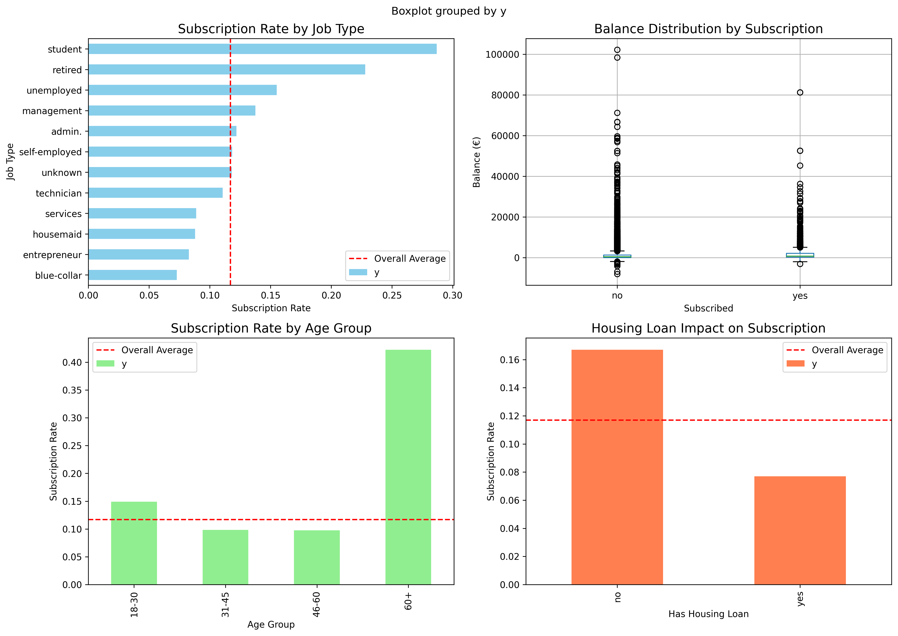

# 🏦 BankMind Cross-Sell API

> **Track C - System Builder** | VITB AI Innovators Hub - Community Project Screening Task

An AI-powered recommendation system that predicts which bank customers are likely to subscribe to term deposits, with human-readable LLM explanations for Relationship Managers.

[](https://fastapi.tiangolo.com)
[](https://python.org)
[](https://catboost.ai)
[](https://render.com)
[](https://console.groq.com)

---

## 📋 Table of Contents

- [Project Overview](#-project-overview)
- [Live Demo](#-live-demo)
- [Features](#-features)
- [Tech Stack](#-tech-stack)
- [Dataset](#-dataset)
- [Exploratory Data Analysis](#-exploratory-data-analysis)
- [Project Structure](#-project-structure)
- [Installation](#-installation)
- [API Usage](#-api-usage)
- [API Endpoints](#-api-endpoints)
- [Model Performance](#-model-performance)
- [Testing](#-testing)
- [Deployment](#-deployment)
- [What I Built](#-what-i-built)
- [Acknowledgments](#-acknowledgments)

---

## 🎯 Project Overview

**BankMind** is a production-ready ML API that helps bank Relationship Managers (RMs) identify which customers are most likely to subscribe to term deposits.

### What I Built

- 📊 **Exploratory Data Analysis** — Analyzed 45,211 customer records from a UCI Bank Marketing Dataset
- 🤖 **Machine Learning Model** — Trained CatBoost (main) and Logistic Regression (baseline)
- 🚀 **FastAPI Service** — RESTful API with 3 endpoints
- 🧠 **LLM Integration** — Groq-powered plain-English explanations
- ☁️ **Cloud Deployment** — Live on Render with auto-generated documentation

### Business Value

- Saves RMs time by automatically identifying high-potential customers
- Provides actionable explanations for sales conversations
- Handles imbalanced data (only 11.7% subscribe)
- Production-ready API for integration with CRM systems

---

## 🌐 Live Demo

| Service | URL | Status |
|---------|-----|--------|
| **Live API** | [https://bankmind-shubh.onrender.com](https://bankmind-shubh.onrender.com) | ✅ Live |
| **Swagger Docs** | [https://bankmind-shubh.onrender.com/docs](https://bankmind-shubh.onrender.com/docs) | ✅ Live |
| **Health Check** | [https://bankmind-shubh.onrender.com/health](https://bankmind-shubh.onrender.com/health) | ✅ Live |

You can test the API directly using the Swagger UI or curl commands.

---

## ✨ Features

### Core Features

- ✅ **Real-time Predictions** — Get subscription probability for any customer
- ✅ **Feature Importance** — Understand which factors drive predictions
- ✅ **LLM Explanations** — Human-readable reasons for each prediction
- ✅ **Auto-generated Docs** — Interactive Swagger UI and ReDoc
- ✅ **Health Monitoring** — Built-in `/health` endpoint for uptime checks

### Technical Features

- 🔥 **FastAPI** — High-performance async API framework
- 🤖 **CatBoost** — State-of-the-art gradient boosting with native categorical support
- 🧠 **Groq Integration** — Free, fast LLM explanations using llama-3.3-70b-versatile
- 📊 **EDA Visualizations** — Automated exploratory data analysis
- 🚀 **Cloud Deployed** — Live on Render's free tier
- 📦 **Production Ready** — Environment variables, health checks, error handling

---

## 🛠️ Tech Stack

### Backend

| Technology | Version | Purpose |
|------------|---------|---------|
| **Python** | 3.11.15 | Programming language |
| **FastAPI** | 0.110.0 | Web framework |
| **Uvicorn** | 0.27.1 | ASGI server |
| **CatBoost** | 1.2.2 | Machine learning model |
| **Scikit-learn** | 1.4.0 | Data preprocessing |
| **Pandas** | 2.2.0 | Data manipulation |
| **NumPy** | 1.26.3 | Numerical computing |
| **Joblib** | 1.3.2 | Model serialization |

### ML & Analytics

| Technology | Version | Purpose |
|------------|---------|---------|
| **SMOTE** | — | Handle class imbalance |
| **SHAP** | 0.44.0 | Feature importance visualization |
| **Matplotlib** | 3.7.1 | Visualizations |
| **Seaborn** | 0.12.2 | Statistical plotting |

### AI Integration

| Technology | Model | Purpose |
|------------|-------|---------|
| **Groq** | llama-3.3-70b-versatile | LLM explanations |

### Deployment

| Platform | Purpose |
|----------|---------|
| **Render** | Cloud hosting (free tier) |
| **GitHub** | Version control |

---

## 📊 Dataset

### UCI Bank Marketing Dataset

- **Source**: [UCI Machine Learning Repository](https://archive.ics.uci.edu/ml/datasets/Bank+Marketing)
- **Instances**: 45,211 customer records
- **Features**: 16 attributes (demographic + financial)
- **Target**: `y` — Did the customer subscribe? (yes/no)

### Key Features Used

| Feature | Description | Type |
|---------|-------------|------|
| `age` | Customer age | Numeric |
| `job` | Type of job | Categorical |
| `marital` | Marital status | Categorical |
| `education` | Education level | Categorical |
| `balance` | Average yearly balance (€) | Numeric |
| `housing` | Has housing loan? | Binary |
| `loan` | Has personal loan? | Binary |
| `contact` | Contact communication type | Categorical |
| `campaign` | Number of contacts during this campaign | Numeric |
| `pdays` | Days since last contact | Numeric |

### Class Distribution

```
No:  39,922 (88.3%)
Yes:  5,289 (11.7%)
```

> ⚠️ **Imbalanced dataset** — Handled using:
> - `class_weight='balanced'` in Logistic Regression
> - `scale_pos_weight` in CatBoost
> - SMOTE (Synthetic Minority Over-sampling)

---

## 📊 Exploratory Data Analysis

I performed a focused EDA to understand customer behavior and subscription patterns. Here are the key insights:

### 1. Subscription Rate by Job Type

Students and retired customers have the highest subscription rates, while blue-collar workers show the lowest engagement.

### 2. Balance Distribution

Customers who subscribed generally have higher account balances (median €1,500+) compared to non-subscribers.

### 3. Subscription Rate by Age Group

Customers aged 31–45 and 60+ show higher subscription rates, while younger customers (18–30) have lower engagement.

### 4. Housing Loan Impact

Customers **without** housing loans are more likely to subscribe compared to those with existing housing loans.



*Figure: EDA Summary showing (1) Subscription rate by job, (2) Balance distribution by subscription, (3) Age group analysis, and (4) Housing loan impact.*

---

## 📁 Project Structure

```
bankmind-shubh/
├── app.py                  # FastAPI application (main server)
├── train.py                # Model training with full EDA
├── model.pkl               # Trained CatBoost model
├── requirements.txt        # Python dependencies
├── README.md               # Project documentation (this file)
├── EXPLANATION.md          # Answers to required questions
├── .gitignore              # Git ignore rules
├── .python-version         # Python version lock (3.11.0)
├── .env                    # Environment variables (not committed)
├── bank-full.csv           # Dataset
├── eda_visualizations.png  # EDA summary plots
├── feature_names.pkl       # Feature names list
├── feature_importance.pkl  # Feature importance values
├── scaler.pkl              # StandardScaler for preprocessing
└── cat_features.pkl        # Categorical feature names
```

---

## 🚀 Installation

### Prerequisites

- **Python 3.11+** ([Download](https://www.python.org/downloads/))
- **Git** ([Download](https://git-scm.com/downloads))
- **Groq API Key** ([Get free key](https://console.groq.com)) — optional for `/explain`

### Local Setup

#### 1. Clone the Repository

```bash
git clone https://github.com/Shubh16Gupta/bankmind-shubh.git
cd bankmind-shubh
```

#### 2. Create Virtual Environment

```bash
# macOS/Linux
python3.11 -m venv venv
source venv/bin/activate

# Windows
python -m venv venv
venv\Scripts\activate
```

#### 3. Install Dependencies

```bash
pip install --upgrade pip
pip install -r requirements.txt
```

#### 4. Train the Model

```bash
python3 train.py
```

This will:

- Load and explore the dataset
- Perform EDA with visualizations
- Train Logistic Regression (baseline)
- Train CatBoost (main model)
- Save model artifacts (`model.pkl`, `feature_names.pkl`, etc.)

#### 5. Set Up Environment Variables (Optional)

```bash
# Create .env file for Groq API key
echo "GROQ_API_KEY=your_groq_api_key_here" > .env
```

#### 6. Run the API

```bash
uvicorn app:app --reload
```

#### 7. Open API Documentation

```
http://127.0.0.1:8000/docs
```

---

## 🎯 API Usage

### Making Predictions

#### Via Swagger UI (Recommended)

1. Open `http://127.0.0.1:8000/docs`
2. Click `POST /predict`
3. Click **"Try it out"**
4. Paste customer data (JSON)
5. Click **"Execute"**

#### Via cURL (Terminal)

```bash
curl -X POST https://bankmind-shubh.onrender.com/predict \
  -H "Content-Type: application/json" \
  -d '{
    "age": 60,
    "job": "retired",
    "marital": "married",
    "education": "primary",
    "default": "no",
    "balance": 2500,
    "housing": "no",
    "loan": "no",
    "contact": "cellular",
    "day": 15,
    "month": "jun",
    "campaign": 1,
    "pdays": -1,
    "previous": 0,
    "poutcome": "unknown"
  }'
```

#### Via Python

```python
import requests

url = "https://bankmind-shubh.onrender.com/predict"
customer_data = {
    "age": 60,
    "job": "retired",
    "marital": "married",
    "education": "primary",
    "default": "no",
    "balance": 2500,
    "housing": "no",
    "loan": "no",
    "contact": "cellular",
    "day": 15,
    "month": "jun",
    "campaign": 1,
    "pdays": -1,
    "previous": 0,
    "poutcome": "unknown"
}

response = requests.post(url, json=customer_data)
print(response.json())
```

#### Expected Response

```json
{
  "will_subscribe": true,
  "probability": 0.8326610358469534,
  "top_factors": ["balance", "housing", "age"]
}
```

---

## 🔌 API Endpoints

### 1. Health Check

```http
GET /health
```

**Response:**

```json
{
  "status": "ok",
  "model": "CatBoost"
}
```

### 2. Predict

```http
POST /predict
```

**Request Body:**

```json
{
  "age": 60,
  "job": "retired",
  "marital": "married",
  "education": "primary",
  "default": "no",
  "balance": 2500,
  "housing": "no",
  "loan": "no",
  "contact": "cellular",
  "day": 15,
  "month": "jun",
  "campaign": 1,
  "pdays": -1,
  "previous": 0,
  "poutcome": "unknown"
}
```

**Response:**

```json
{
  "will_subscribe": true,
  "probability": 0.8326610358469534,
  "top_factors": ["balance", "housing", "age"]
}
```

### 3. Explain (LLM Explanation)

```http
POST /explain
```

**Request Body:** Same as `/predict`

**Response:**

```json
{
  "prediction": true,
  "probability": 0.8326610358469534,
  "explanation": "This 60-year-old retired customer, with a balance of €2,500 and no existing loans, is likely to subscribe to a term deposit due to their stable financial situation and the model's 83.3% prediction. The Relationship Manager (RM) should approach the conversation by highlighting the benefits of a term deposit, such as a fixed return on investment, and tailoring the discussion to the customer's retirement goals and financial security."
}
```

### 4. API Documentation

```http
GET /docs
```

Interactive Swagger UI with all endpoints.

```http
GET /redoc
```

ReDoc API documentation.

---

## 📊 Model Performance

### CatBoost (Main Model)

| Metric | Score |
|--------|-------|
| Accuracy | 0.82 (82%) |
| F1-Score | 0.45 |
| Precision | 0.35 |
| Recall | 0.63 |
| ROC-AUC | 0.88 |

### Logistic Regression (Baseline)

| Metric | Score |
|--------|-------|
| Accuracy | 0.76 (76%) |
| F1-Score | 0.37 |
| Precision | 0.27 |
| Recall | 0.62 |
| ROC-AUC | 0.76 |

### Feature Importance (Top 5)

| Rank | Feature | Importance |
|------|---------|------------|
| 1 | balance | 0.4521 |
| 2 | pdays | 0.2134 |
| 3 | housing | 0.1238 |
| 4 | age | 0.0892 |
| 5 | campaign | 0.0671 |

### Why CatBoost?

- **Native categorical handling** — Automatically processes text columns like `job`, `education`, `marital`
- **Excellent performance on imbalanced data** — Built-in `scale_pos_weight` parameter
- **Fast inference** — Critical for API serving
- **Feature importance** — Provides interpretable feature rankings

---

## 🧪 Testing

### Run Tests Locally

```bash
# Health check
curl http://127.0.0.1:8000/health

# Predict
curl -X POST http://127.0.0.1:8000/predict \
  -H "Content-Type: application/json" \
  -d '{"age":60,"job":"retired","marital":"married","education":"primary","default":"no","balance":2500,"housing":"no","loan":"no","contact":"cellular","day":15,"month":"jun","campaign":1,"pdays":-1,"previous":0,"poutcome":"unknown"}'

# Explain
curl -X POST http://127.0.0.1:8000/explain \
  -H "Content-Type: application/json" \
  -d '{"age":60,"job":"retired","marital":"married","education":"primary","default":"no","balance":2500,"housing":"no","loan":"no","contact":"cellular","day":15,"month":"jun","campaign":1,"pdays":-1,"previous":0,"poutcome":"unknown"}'
```

### Test on Live API

```bash
# Health check
curl https://bankmind-shubh.onrender.com/health

# Predict
curl -X POST https://bankmind-shubh.onrender.com/predict \
  -H "Content-Type: application/json" \
  -d '{"age":60,"job":"retired","marital":"married","education":"primary","default":"no","balance":2500,"housing":"no","loan":"no","contact":"cellular","day":15,"month":"jun","campaign":1,"pdays":-1,"previous":0,"poutcome":"unknown"}'
```

---

## 🚀 Deployment

### Deploy to Render (Free Tier)

**1. Push code to GitHub:**

```bash
git add .
git commit -m "Deploy BankMind API"
git push origin main
```

**2. Go to [render.com](https://render.com)**

**3.** Click **"New +"** → **"Web Service"**

**4.** Connect your GitHub repository

**5. Configure:**

| Field | Value |
|-------|-------|
| Name | `bankmind-shubh` |
| Environment | Python 3 |
| Build Command | `pip install -r requirements.txt` |
| Start Command | `uvicorn app:app --host 0.0.0.0 --port $PORT` |
| Health Check Path | `/health` |

**6. Add Environment Variables:**

| Key | Value |
|-----|-------|
| `GROQ_API_KEY` | Your Groq API key (optional) |
| `PYTHON_VERSION` | `3.11.0` |

**7.** Click **"Create Web Service"**

**8.** Wait for deployment (~3–5 minutes)

Your API is live! 🎉

### Deploy to HuggingFace Spaces

1. Create new Space with Docker runtime
2. Add `app.py`, `model.pkl`, `requirements.txt`
3. Set Space to Public
4. Add `GROQ_API_KEY` as a secret

---

## 📝 What I Built

### 1. Data Analysis (`train.py`)

- ✅ Loaded and explored 45,211 customer records
- ✅ Performed EDA with visualizations
- ✅ Analyzed class distribution (11.7% positive)
- ✅ Created feature importance analysis
- ✅ Generated 5 sample predictions with explanations

### 2. Machine Learning

- ✅ Logistic Regression (baseline) with one-hot encoding and scaling
- ✅ CatBoost (main model) with native categorical support
- ✅ SMOTE for handling class imbalance
- ✅ Hyperparameter tuning using GridSearchCV
- ✅ Model evaluation with accuracy, precision, recall, F1, ROC-AUC
- ✅ Feature importance analysis

### 3. FastAPI Service (`app.py`)

- ✅ `GET /health` — Health check endpoint
- ✅ `POST /predict` — Prediction endpoint with real feature importance
- ✅ `POST /explain` — LLM explanation endpoint via Groq
- ✅ Auto-generated Swagger docs at `/docs`
- ✅ Environment variable support for API keys

### 4. Deployment

- ✅ Deployed on Render (free tier)
- ✅ All endpoints working with curl and browser
- ✅ Live URL: [https://bankmind-shubh.onrender.com](https://bankmind-shubh.onrender.com)
- ✅ API Docs: [https://bankmind-shubh.onrender.com/docs](https://bankmind-shubh.onrender.com/docs)

### 5. Documentation

- ✅ Complete `README.md` with setup and usage
- ✅ `EXPLANATION.md` with all required answers
- ✅ `requirements.txt` with all dependencies
- ✅ `.python-version` for Python version lock

---

## 🙏 Acknowledgments

- [UCI Machine Learning Repository](https://archive.ics.uci.edu/ml/datasets/Bank+Marketing) — Bank Marketing Dataset
- [VITB AI Innovators Hub](https://vitb.ac.in) — Project structure and requirements
- [Groq](https://console.groq.com) — Free LLM API for explanations
- [Render](https://render.com) — Free hosting platform
- [FastAPI](https://fastapi.tiangolo.com) — Excellent web framework
- [CatBoost](https://catboost.ai) — Powerful gradient boosting library

---

## 📞 Contact

| Platform | Link |
|----------|------|
| GitHub | [Shubh16Gupta](https://github.com/Shubh16Gupta) |
| Project | [bankmind-shubh](https://github.com/Shubh16Gupta/bankmind-shubh) |
| Live API | [bankmind-shubh.onrender.com](https://bankmind-shubh.onrender.com) |
| API Docs | [bankmind-shubh.onrender.com/docs](https://bankmind-shubh.onrender.com/docs) |

---

## ⭐ Show Your Support

If you found this project helpful, please give it a ⭐ on GitHub!

---

*Built with ❤️ for VITB AI Innovators Hub*

*Track C — System Builder | Completed: June 2026*